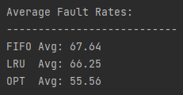

# Report

### First In First Out (FIFO)
---
This algorithm reads the reference strings, and adds the referenced page numbers (or process) to the page frame in which they appear.
The page frame can only hold a certain amount of processes depending on the allocated space given before the algorithm begins (page frame).
Once all frames are occupied, when a new process sends a request, it replaces the process first process that appeared, as it is
a first in first out process. If page number sends a request while a simlar page number is already in the page frame it is skipped over.

### Least Recently Used (LRU)
---
This algorithm acts the same way as FIFO, but differs in how it decides which process to replace when a new one sends a request.
When a new page number sends a request, the process in the page frame that gets removed depends on how recent it was used. In this case,
the oldest process in the page frame will be removed and replaced. Additionally, unlike FIFO, this algorithm also takes into account any page numbers 
that send a request but there is already a similar process in the page frame; in this scenario, if that page frame was not the most recently used process,
after the request it the most recent.

### Optimal (OPT)
This algorithm unlike LRU, looks at future page rather previous ones to determine which frame to replace. When a page number sends a request,
the algorithm looks at all subsequent page numbers in the reference string, if a process in the page frame no longer appears it will be replaced.
If all processes in the page frame still appear, it then replaces the page number that appears the least in the reference string with the new process.

### Conclusion 

From the data collected, based on the average fault rates collected from each of the algorithm it can be concluded that the OPT algorithm is the most efficient.
Both the LRU and FIFO algorithms produced similar fault rate averages, whilst the OPT algorithm had the lowest average fault rate, meaning that it had to peform
the least amount of page replacements.

Additionally, from the additional random reference strings with their increasing size and page frame, within each algorithm the random reference strings that 
shared the same page frames seem to increase the total page faults as the length of the reference string increase. While increasing the max page frames 
seems to decrease the total page faults contradicting the Belady's Anomaly. This occurence may be resulting from the fact that the same reference string is not
being used as the total page frames increases.
